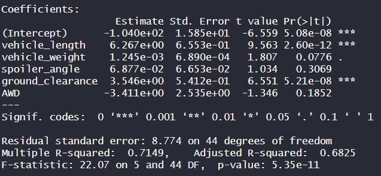
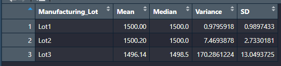
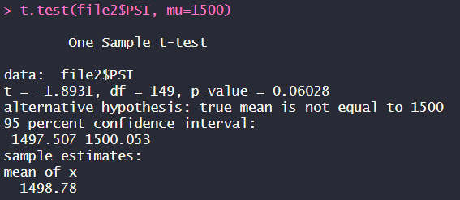
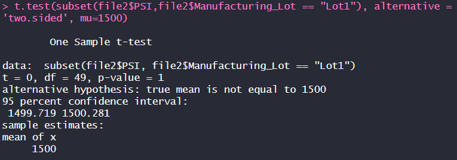
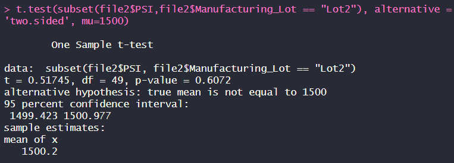
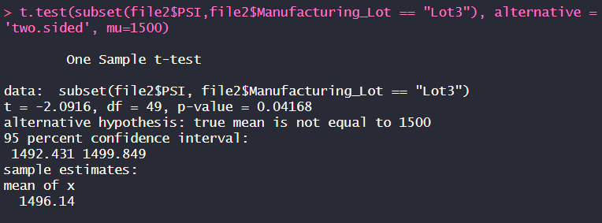

# MechaCar_Statistical_Analysis

## Overview
A client requested that we look at the statistical data for a new prototype of car called the MechaCar. MechaCar, AutosRUs' newest prototype, is suffering from production troubles and we are looking to find insights that may help the manufacturing team. Based on the data we have and the statistical studies, we have conclusions that help us focus on specific aspects of the car so that key production resources can be invested in the important aspects of the car.

## Linear Regression to Predict MPG

1. According to our results, the variables that prodide a non-random amount of variance is the intercept, vehicle_length, and ground_clearence. 
The coefficients are as follows:
- Intercept: Approximately 0 < 0.5 which is statistically significant. Non-random amount of variance.
- Vehicle Length: Approximately 0 < 0.5 which is statistically significant. Non-random amount of variance.
- Vehicle Weight: 0.08 > 0.5 which is not statistically significant.
- Spoiler Angle: 0.31 > 0.5 which is not statistically significant.
- Ground Clearence: Approximately 0 < 0.5 which is statistically significant. Non-random amount of variance.
- AWD: 0.19 > 0.5 which is not statistically significant.

This means that vehicle length and ground clearence will have a significant impact on the MPG. The fact that the intercept is included implies that there are other variables that are not accounted for in our dataset which contribute to the MPG.

2. The slopes of the linear model are as follows:
- Vehicle Length: 6.267
- Vehicle Weight: 0.001
- Spoiler Angle: 0.069
- Ground Clearence: 3.546
- AWD: -3.411
The multiple linear regression formula is mpg = -0.01 + 6.267*vehicle_length + 0.0001*vehicle_weight + 0.069*spoiler_angle + 3.546*ground_clearence - 3.411*AWD. This results in a non-zero slope.

3. This linear model is a good predictor of mpg for MechaCar Prototypes because R-Squared is 0.7149. This is a close to strong correlation for the dataset. However, considering the statistically significant intercept, we can assume that there could be a better model with variables not represented in this dataset.

## Summary Statistics on Suspension COils
### Manufacturing Lot Summary

The summary above shows the statistics for all manufacturing lots. The mean is 1498.78 with a standard deviation of 7.89.

The summary above shows the statistics for each indivdual manufacturing lots. Comparing the summary from the total reveals that most of the variance comes from lot 3.

### Overall Summary
Based on the summaries shown, as a whole the variance on these lots seem to be within the manufacturing specifications. However, seeing the larger variance the individual lots reveal that lot 3 is the only lot that does not meet specifications by far. Lot 3 will cause problems for MechaCar if the variance is not dealt with soon.

## T-Test on Suspension Coils

Based on the t-test for all lots, we see that the test on total manufaturing lots fails to reject the null hypthesis with a p-value = 0.06 > 0.05. This means that the mean for all lots is not different from the population mean of 1500.

Based on the t-test for all lots, we see that the test on lot 1 to reject the null hypthesis with a p-value = 1 > 0.05. This means that the mean for Lot 1 is not different from the population mean of 1500.

Based on the t-test for all lots, we see that the test on lot 2 fails to reject the null hypthesis with a p-value = 0.61 > 0.05. This means that the mean for Lot 2 is not different from the population mean of 1500.

Based on the t-test for all lots, we see that the test on lot 3 rejects the null hypthesis with a p-value = 0.04 < 0.05. This is statistically significant which means that Lot 3 is different from the population mean of 1500.

## Study Design: MechaCar vs Competition
MechaCar, like all cars, will need to meet the desired metrics of as many potential buyers. When comparing with the competition, the metrics of interest would be: cost, fuel efficiency (city and highway), horsepower, safety rating, 0 to 60 time, fuel capacity (especially with the increasing popularity of electric cars).

The metric that I would test would be fuel efficiency (city and highway). I would be testing to see if the fuel efficiency of MechaCar is better than the competition. To do this, I would use a one-sided t-test to see if the average fuel efficiency of MechaCar is statistically significant in comparison to the competition.
- Null Hypothesis: The average fuel efficiency of MechaCar is not greater than the competition.
- Alternative Hypotehesis: The average fuel efficieny of MechaCar is greater than the competition.

In order to run the statistical test, I would need the fuel efficiency for a few samples from the competition. A good number would be 50 or more cars. From then, I can compare the average fuel efficiency from MechaCar and the Competition.
